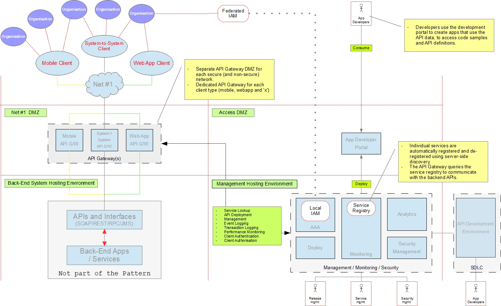
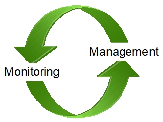
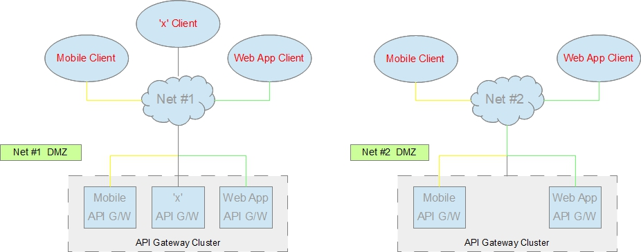

API Gateway Pattern
===================

Abstract
--------

The intended audience of this document is Project Managers, Product
Managers, Architects and Engineers.

The goals of this document are;

1.  Describe the Edge API Gateway Architecture Pattern in such a way
    that it can be used by it\'s audience to make decisions on
    capabilities and technology when providing access to information
    using an API.

2.  Reduce the technology \'spread\' of existing API Gateway solutions
    so that a centre of competence can be established in one or two key
    technologiess.

3.  Simplify the department\'s procurement process when dealing with
    suppliers.

 The Edge API Gateway pattern illustrates the key components of the
architecture when using an API Gateway for;

-   Edge security authentication and authorisation

-   API call routing

-   Format translation -- SOAP/REST/RPC.

-   Traffic control (throttling)

-   Dynamic service discovery.

NOTE: Though the capabilities of API Gateways also include the ability
to orchestrate back-end services and to combine multiple calls in to a
single client call, they are not part of this pattern.

 The API Gateway becomes the single point of entry for client requests.

Context
-------

The Edge API Gateway Architecture Pattern is for use in an environment
that has multiple clients calling APIs from mobile, desktop and business
systems over multiple channels both private and public It is therefore
necessary to have a means of developing, deploying, managing and
securing those APIs in a controlled fashion.

The main features of an API Gateway and an API Management Solution are;

1.  API Security -- Authentication, Authorisation, Audit, Transport
    Security.

2.  Traffic Management -- Load-Balancing, Rate limiting / Quality of
    Service

3.  Versioning -- Multiple API access points

4.  Protocol Translation (SOAP / REST / RPC)

5.  Request Aggregation

6.  Development Portal

7.  Deployment Portal

8.  API Call Routing

9.  Dynamic Service Discovery

Problem
-------

Clients require access to information provided by APIs. How are these
Clients granted the correct access to the correct APIs. How is the
granting and revocation of that access managed and controlled.

Forces
------

This section intentionally left blank.

Solution
--------

The API Gateway Context Diagram below shows the API Gateway and its
supporting functions. In this illustration it is shown working in
conjunction with multiple back-end API services from new microservices
to legacy systems. 

 NOTE: Although many ESB products are capable of providing API Gateway
functionality, this pattern separates the two for reasons of
performance, security and simplicity.

Definitions
-----------

  **Term**   **Definition**
  ---------- -----------------------------------------------------------------------------------------------------------------------------
  API        Application Programming Interface - A remotely accessible interface for sending or receiving a specific set of information.
  Client     The [application]{.underline} (such as a Web Application, Native Application or another system) calling the API.
  IAM        Identity and Access Management System

Service (API) Registration and Server-Side Discovery
----------------------------------------------------

This pattern assumes the implementation of both the [*Server-Side
Discovery*](#APIGatewayPattern-Related_Patterns) pattern and the
[*[Third-Party
Registration]{.underline}*](#APIGatewayPattern-Related_Patterns) pattern
in order for the API Gateway to route requests to the appropriate API
service(s). These patterns simplify the use of the API(s) by the Client
and also provide a higher level of control over the starting, stopping,
addition and removal of new API services as well as the management of
API failures.

Implementing these patterns into the environment means that Services are
registered with a service manager service as part of the deployment
process. Once registered, the service manager service is the means by
which other services can be found and is responsible for starting,
stopping and monitoring each API. In the event of a failure, the service
manager will restart a new instance of the API.

This registration process will form part of the automated deployment and
retirement of services.

 

Before selecting a solution approach, consideration should be given to
the expected rate of change of services and clients. For low-change
environments, it may be acceptable to have a manual process for service
registration and discovery. However, when there is an element of doubt
as the future rate of change, the dynamic service discovery approach
should be implemented.

The service manager service is a crucial component of the monitoring
subsystem and in the implementation of the
[*[Circuit-Breaker]{.underline}*](#APIGatewayPattern-Related_Patterns)
pattern.

API Authentication and Authorisation
------------------------------------

This pattern mandates the authentication of a Client trying to access an
API. This can be done using a number of methods in line with the Home
Office Authentication and Authorisation Standard Version n. ***Reference
to be supplied (if there is one).***

When a Client is registered with the Identity and Access Management
infrastructure, it will be allocated credentials to use when accessing
the API Gateway. The API Gateway validates the credentials provided by
the Client itself or using an existing Identity and Access Management
infrastructure.

The communication link between the Client and the API Gateway **must**
be encrypted so that the credentials are protected appropriately for the
risk.

The purpose of the API Gateway is to offload Client authentication and
authorisation from the back-end APIs which are effectively accessed
anonymously, therefore consideration should be given to authenticating
and authorising communication between the API Gateway and the back-end
services. The risk of compromised and/or non-legitimate use should be
carefully evaluated. Where the API Gateway is co-hosted in the same
hosting environment as the back-end services, mutual authentication
between the API Gateway and the services may be unnecessary. If however,
the API Gateway is remote from one or more back-end services, then
mutual authentication between the gateway and the service(s) should be
very seriously considered. 

The use of client certificates for TLS mutual authentication should be
considered, both between Client and API Gateway and between API Gateway
and back-end service.

Management and Monitoring
-------------------------

In the context of this pattern;

-   \"Management\" is the proactive operation, support and maintenance
    of the API Gateway including patching, upgrading, deploying,
    managing access, modifying access and performing analytics of
    events, logs and telemetry.

-   \"Monitoring\" is the periodic (or continuous) checking of
    functions, of operations and of devices, recording of data and
    measurement of actuals against thresholds.

Management uses monitoring and monitoring informs management.

### API Gateway Operational Management

This pattern assumes the use of an existing Infrastructure management
capability with the API Gateway management tools becoming part of the
existing capability. The integration of these tools is beyond the scope
of this pattern.

System and application logs and events from each component of the API
Gateway pattern are collected, aggregated and made available for
analysis and search.

### API Gateway Security Management

This pattern assumes the use of an existing security management
capability for managing Client and User authentication, authorisation
and audit. The integration of these tools is beyond the scope of this
pattern.

### API Development and Deployment

For changing the configuration of the API Gateway by This pattern
assumes the use of an existing Deployment capability that uses a
Continuous Integration, Continuous Delivery and/or Continuous Deployment
approach. The integration of these tools is beyond the scope of this
pattern.

Time Synchronisation.
---------------------

A common source of time is required for every component in this pattern.
It is assumed that this will use NTP and will be supplied as an external
service to this pattern.

This also needs a reference to the appropriate documentation for how to
consume the common source of time.

Resilience
----------

The API Gateway should access the back-end services using the *[Circuit
Breaker](#APIGatewayPattern-Related_Patterns)* pattern. This means that
a failure in a back-end service will not cause the API Gateway or the
Client to wait endlessly for a back-end service that has failed or hung.

Implementing the *Circuit Breaker Architecture* pattern means that a
decision must be made by the implementers of this pattern on the length
of time that each data item can be cached for, before it becomes stale
and invalid. In certain cases, this may be seconds or fractions of a
second, in others it may be several weeks. The decision must be made for
each type of data.

It is strongly recommended that an existing library is used for this
purpose such as Netflix Hystrix <https://github.com/Netflix/Hystrix>,
rather than new code being developed from scratch.

The [*Backend for Frontends*](#APIGatewayPattern-Related_Patterns)
pattern should be considered when deploying API Gateways as shown in
[Edge API Gateway Context Diagram](#APIGatewayPattern-Context_Diagram) .
This pattern provides a separate API Gateway for each type of Client.
For example, if an API is being accessed from both a native mobile app
and from a B2B system, the Backends for Frontends pattern allows each
API to be optimised for that particular client and allows each API to be
deployed and managed separately. Thjis pattern means it is possible for
a browser and a native app on the same mobile device to be accessing a
different API.

Subject to security requirements and to the technology solution chosen,
the gateways in the [*Backends for
Frontends*](#APIGatewayPattern-Related_Patterns) pattern can be logical
instances rather than physical instances. In addition, consideration
should also be given to deploying separate API Gateways when there are
different network types and security levels. As can be seen from the
illustration below, the Net \#1 DMZ demonstrates the use of a logically
segmented API Gateway which is the interface for clients on Net \#1. Net
\#2 is at a different security level and therefore requires the
implementation of another API Gateway for (in this case) a reduced set
of clients.

Consideration should be given to the use of load-balancing rather than
clustering in order to provide resilience and performance for the API
Gateway nodes. The rationale for this is that removing the complexity
and processing overhead of clustering functionality is a sensible course
of action for high load or critical availability environments. Although
this approach introduces a new infrastructure component into the
environment, it also reduces the complexity of the hosting servers and
removes any dependencies between them. It also means that back-end
servers can be heterogeneous rather than homogeneous.

Example
-------

This section intentionally left blank.

Resulting Context
-----------------

This section intentionally left blank.

Related Patterns
----------------

### API and Microservices

1.  Anti-Corruption Layer Pattern
    <https://docs.microsoft.com/en-us/azure/architecture/patterns/anti-corruption-layer>

2.  Health Check API Pattern
    <http://microservices.io/patterns/observability/health-check-api.html>

3.  Backends for Frontends Pattern
    <http://samnewman.io/patterns/architectural/bff/>

4.  Third-Party Registration Pattern
    <http://microservices.io/patterns/3rd-party-registration.html> and
    <https://github.com/Netflix/eureka/wiki>

5.  Server-Side Discovery Pattern
    <http://microservices.io/patterns/server-side-discovery.html> and
    <https://github.com/Netflix/eureka/wiki>

6.  Circuit-Breaker Pattern
    <http://microservices.io/patterns/reliability/circuit-breaker.html>
    and
    <https://docs.microsoft.com/en-us/azure/architecture/patterns/circuit-breaker>

### Operations and Infrastructure

1.  Load-balancing Pattern

2.  Clustering Pattern

Known Uses
----------

This section intentionally left blank.

Variations
----------

This section intentionally left blank.
